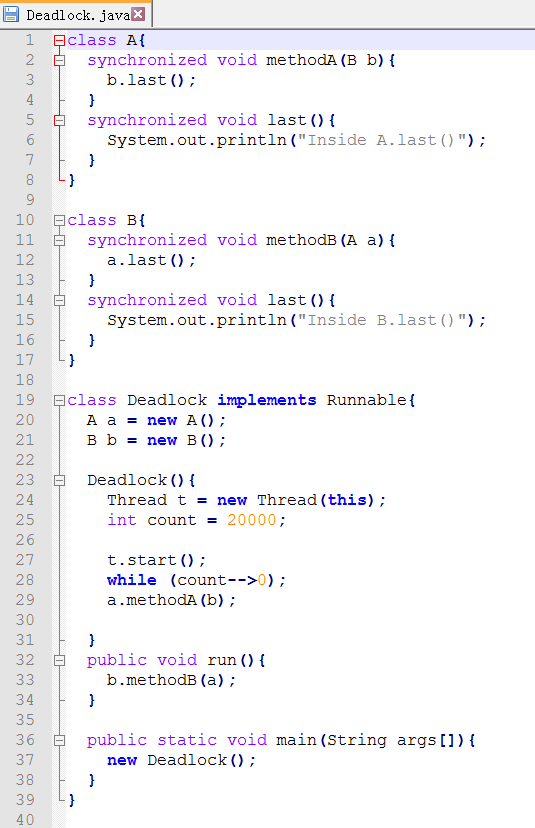
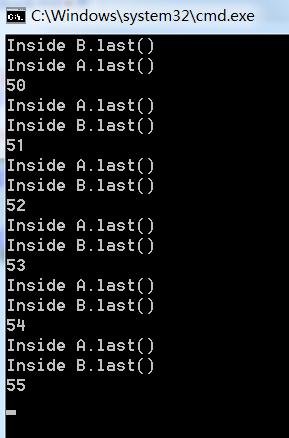

#Deadlock实验报告  
###1、实验步骤：
#####编写Deadlock.java

#####javac Deadlock.java
编译成功后出现下图文件

#####检测死锁
  
这段代码的意思是将步骤1的程序运行100遍  
在第55遍发生死锁  

###实验总结
关于死锁:  
死锁就是两个或者多个进程，互相请求对方占有的资源，他有以下四个必要条件：  
1 互斥条件：一个资源每次只能被一个进程使用  
2 请求与保持条件：一个进程因请求资源而阻塞时，对已获得的资源保持不放  
3 不剥夺条件:进程已获得的资源，在末使用完之前，不能强行剥夺  
4 循环等待条件:若干进程之间形成一种头尾相接的循环等待资源关系 

实验中的死锁：
首先看图1的代码，A B两个类的函数均用synchronized关键字来修饰，该关键字保证同时只能有一个进程访问该代码，我们把A B看作两个进程，last看作A B占有的资源，method表示申请资源，那么如果A Bmethod同时进行，A在等待B的资源，而B在等待A的资源，造成循环等待，形成死锁。  
在Deadlock中，t.start()之后运行b.methodA（）,然后count进行delay后运行a.methodB(),多次运行程序后，容易出现两个method同时出现在一个时间片，造成死锁。

