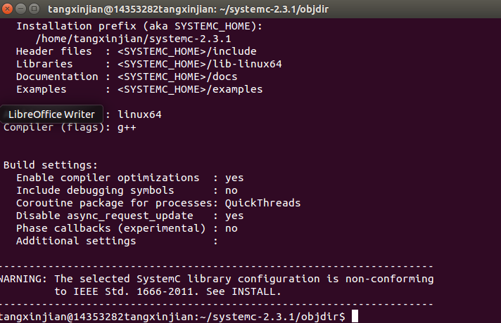
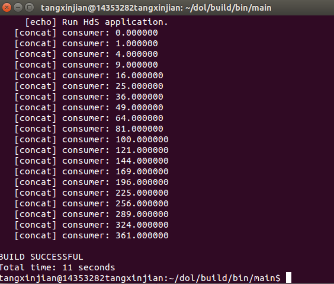

#DOL框架描述
The distributed operation layer (DOL) is a framework that enables the (semi-) automatic mapping of applications onto the multiprocessor SHAPES architecture platform. The DOL consists of basically three parts:

DOL Application Programming Interface: The DOL defines a set of computation and communication routines that enable the programming of distributed, parallel applications for the SHAPES platform. Using these routines, application programmers can write programs without having detailed knowledge about the underlying architecture. In fact, these routines are subject to further refinement in the hardware dependent software (HdS) layer.

DOL Functional Simulation: To provide programmers a possibility to test their applications, a functional simulation framework has been developed. Besides functional verification of applications, this framework is used to obtain performance parameters at the application level.

DOL Mapping Optimization: The goal of the DOL mapping optimization is to compute a set of optimal mappings of an application onto the SHAPES architecture platform. In a first step, XML based specification formats have been defined that allow to describe the application and the architecture at an abstract level. Still, all the information necessary to obtain accurate performance estimates is contained.

#DOL安装笔记
#####1:  
使用vmware安装ubuntu  
安装一些必要的环境：

$sudo apt-get update  
$sudo apt-get install ant  
$sudo apt-get install openjdk-7-jdk  
$sudo apt-get install unzip

#####2:  
解压dolethz.zip文件到新建的dol文件夹中去  
解压systemc  

$mkdir dol  
$unzip dol_ethz.zip -d dol  
$tar -zxvf systemc-2.3.1.tgz

#####3：  
编译systemc

$cd systemc-2.3.1  
$mkdir objdir  
$cd objdir  
$../configure CXX=g++ --disable-async-updates  

下图为configure之后所见的图  

$sudo make install  
$pwd 记录当前路径

#####4：  
编译dol  
$cd ../dol 
 
修改build_zip.xml文件  
将  
property name="systemc.inc" value="YYY/include"  
修改为  
property name="systemc.lib" value="YYY/lib-linux/libsystemc.a"  
64位 系统的机器，lib-linux要改成lib-linux64  

$ant -f build_zip.xml all  
$cd build/bin/main  
$ant -f runexample.xml -Dnumber=1

测试第一个样例得到下图： 

#实验心得
本次实验教程步骤已经给的非常详细了，但是还是有一些坑  
比如在跑最后一步时总是提醒我没有权限，后来发现是要加sudo取得管理权限的
然后我的ubuntu是64位系统，修改build_zip要加64
最后我的ubuntu是中文系统，所以要把example.xml那个215-217行删掉

